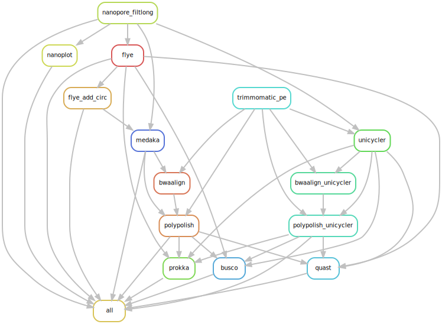

# Nanosake
A Snakemake workflow to quality control and assemble Nanopore data using Long reads first followed by a Hybrid approach.

## Summary

The Nanosake workflow can be split into two parts based on the type of data it uses first to assemble the reads (Long reads Flye assembly vs Hybrid Unicycler assembly)

In short, it performs the following steps:

- Runs [Filtlong](https://github.com/rrwick/Filtlong) to remove low quality reads and discards reads less than 1000 Bp. (--min_length 1000 --keep_percent 95)
- Generates pre and post-Filtlong QC plots using [Nanoplot](https://github.com/wdecoster/NanoPlot).
- Assemble clean filtlong nanopore reads with [Flye](https://github.com/fenderglass/Flye) assembler.
- Flye-only assembly is then polished with long reads using Medaka, followed by polishing with clean trimmed illumina reads using [Polypolish](https://github.com/rrwick/Polypolish) to generate Flye+Medaka+Polypolish assembly.
- For the short illumina read first approach, Long reads are assembled in hybrid mode using [Unicycler](https://github.com/rrwick/Unicycler), followed by polishing with short reads using Polypolish.
- The Flye-only, Flye+Medaka+Polypolish, Unicycler+Polypolish assemblies the passes through [Prokka](https://github.com/tseemann/prokka) for annotation, [BUSCO](https://busco.ezlab.org/) for assembly completeness statistics and [QUAST](https://quast.sourceforge.net/) for assembly statistics.
- All the final assemblies and annotation files are finally placed in prokka directory.

The workflow generates all the output in the output prefix folder set in the config file. Each workflow steps gets its own individual folder as shown below:

```
results/2024-05-01_Test_singularity/
├── busco
├── filtlong
├── flye
├── medaka
├── nanoplot
├── polypolish
├── polypolish_unicycler
├── prokka
├── quast
├── trimmomatic
└── unicycler
```


## Installation

> Clone the github directory onto your system.

```

git clone https://github.com/Snitkin-Lab-Umich/Nanosake.git

```

> Ensure you have successfully cloned Nanosake. Type `ls` and you should see the newly created directory **_Nanosake_**. Move to the newly created directory.

```

cd Nanosake

```

> Load bioinformatics, snakemake and singularity modules from Great Lakes modules.

```

module load Bioinformatics

```

```

module load snakemake singularity

```

This workflow makes use of singularity containers available through [State Public Health Bioinformatics group](https://github.com/StaPH-B/docker-builds). If you are working on Great Lakes (umich cluster)—you can load snakemake and singularity modules as shown above. However, if you are running it on your local or other computing platform, ensure you have snakemake and singularity installed.

## Setup config and samples files

### Customize config.yaml and set tool specific parameters
As an input, the snakemake file takes a config file where you can set the path to `samples.tsv`, path to ONT long reads and illumina short reads, path to adapter fasta file etc. Instructions on how to modify `config/config.yaml` is found in `config.yaml`. 

### Samples

`samples.tsv` should be a comma seperated file consisting of four columns—barcode_id(barcode id outputted by Minion or can be same as sample_id in case you don't have barcode information),sample_id (genome ID—this should be the prefix that is extracted from your illumina fastq reads), illumina_r1 (forward read 1), illumina_r2 (reverse read 2).

You can create sample.tsv file using the following for loop. It assumes that you are running for loop from the folder that contains your illumina short reads.
  
```

echo "barcode_id,sample_id,illumina_r1,illumina_r2" > samples.tsv

for read1 in *_R1.fastq.gz; do sample_id=`echo $i | sed 's/_R1.fastq.gz//g'`; read2=`echo $i | sed 's/_R1.fastq.gz/_R2.fastq.gz/g'`; echo $sample_id,$sample_id,$read1,$read2; done >> sample.tsv 

```


## Quick start

### Run Nanosake on a set of samples.


>Preview the steps in Nanosake by performing a dryrun of the pipeline.

```

snakemake -s workflow/Nanosake.smk --dryrun -p

```
>Run the pipeline. 
```

snakemake -s workflow/Nanosake.smk -p --use-conda -j 999 --cluster "sbatch -A {cluster.account} -p {cluster.partition} -N {cluster.nodes}  -t {cluster.walltime} -c {cluster.procs} --mem-per-cpu {cluster.pmem}" --conda-frontend conda --cluster-config config/cluster.json --configfile config/config.yaml --latency-wait 1000

```




You can generate a MultiQC report on prokka, quast, busco and nanoplot folders after you finish running the snakemake workflow above.

>Activate multiqc using conda.

```

conda activate /nfs/turbo/umms-esnitkin/conda/multiqc

```
> Change `multiqc_report_filename` to a file name of your choice and `multiqc_output_dir` to an output directory name of your choosing. Run multiqc on output folders specified above.
```

multiqc --filename multiqc_report_filename -o multiqc_output_dir -f prokka/ busco/ quast/ nanoplot/

```
